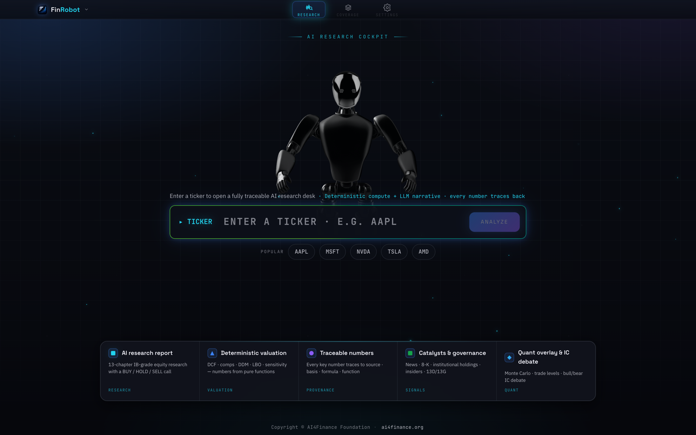
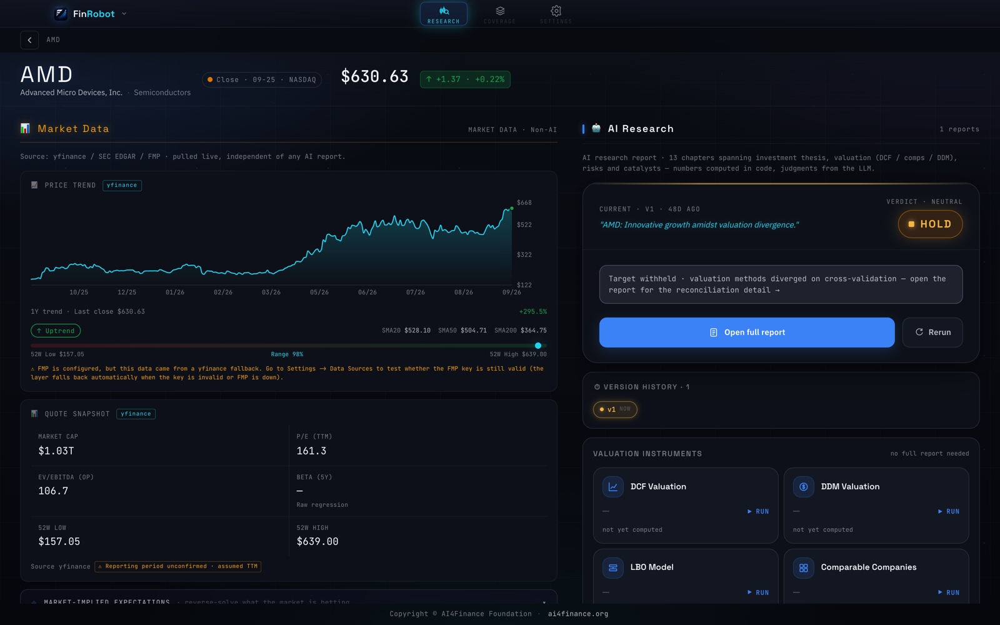
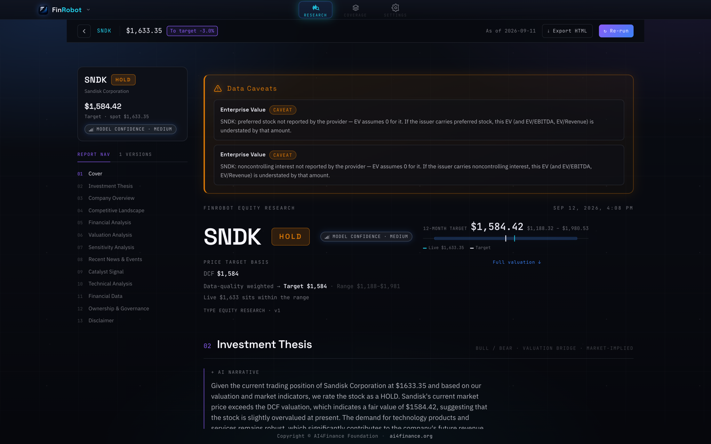
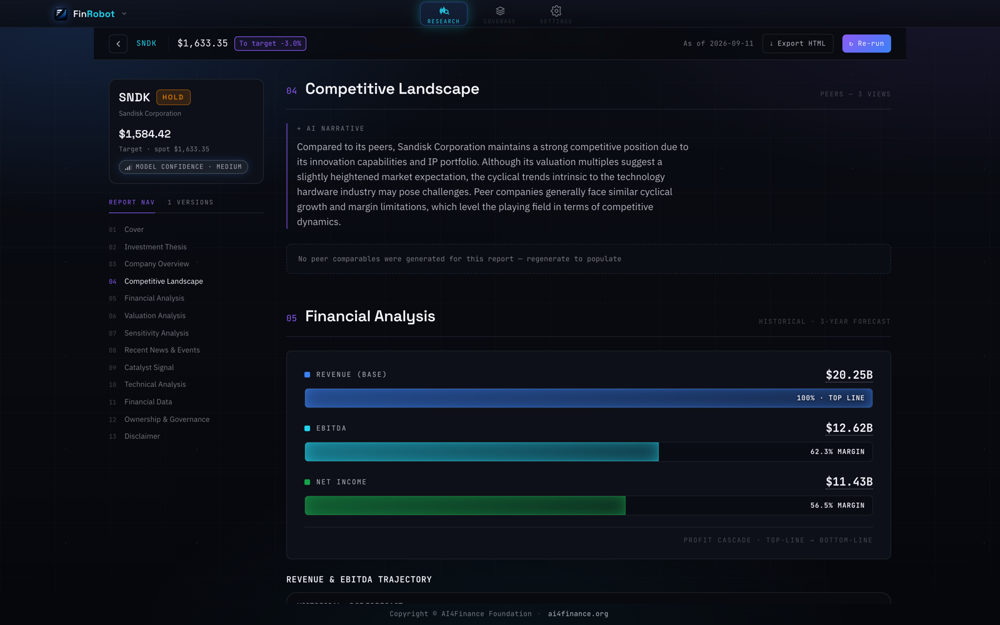
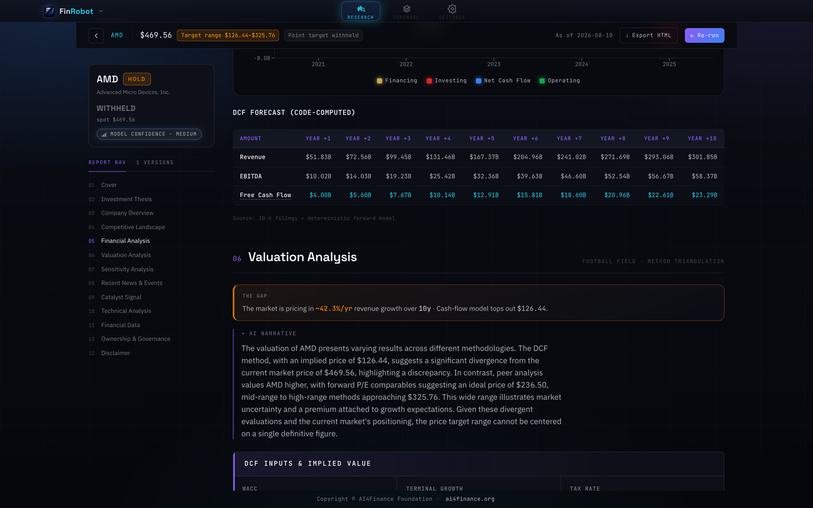
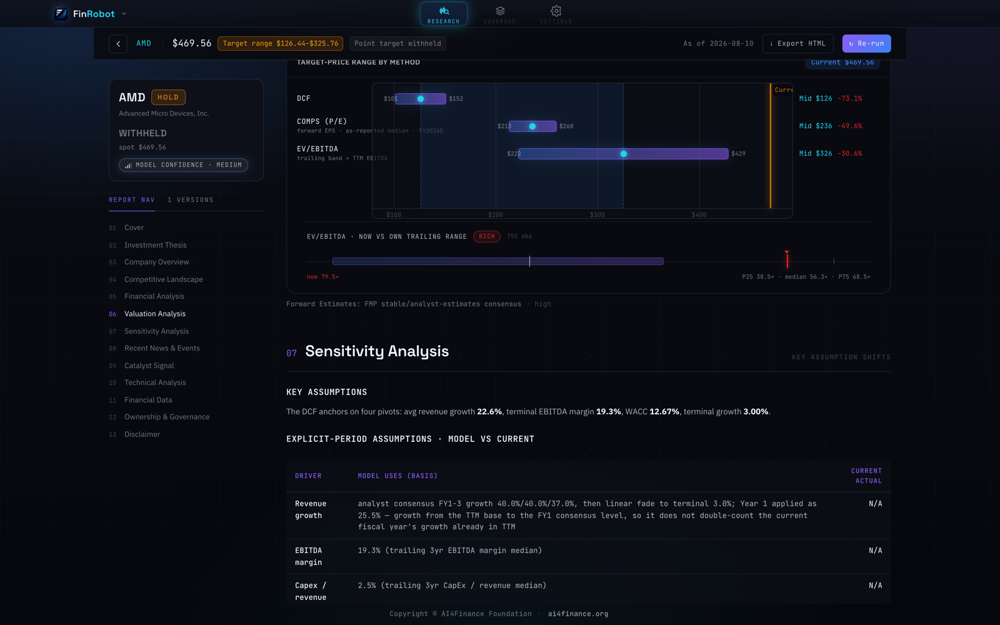
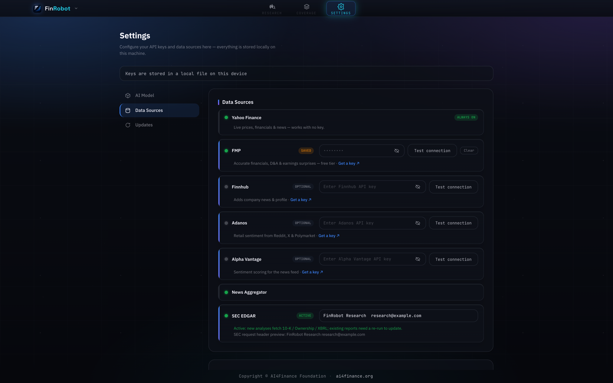

# FinRobot Desktop — V2

> **The production FinRobot.** Investment-bank-grade equity research in a desktop app: deterministic finance numbers plus LLM narrative, with every figure traceable back to a function call.

FinRobot Desktop is an open-source equity research workstation for analysts, quantitative researchers, and active investors. A single `research` run produces a 13-chapter artifact — Cover, Investment Thesis, Company Overview, Financial Analysis, Valuation, Recent News, Sensitivity, Catalysts, Technical & Advanced, Competitive Landscape, Financial Data, Ownership & Governance, Disclaimer.

**The core bet: numbers are computed by code, judgment is supplied by the LLM.** The model never emits a figure that cannot be traced back to a call in `finrobot/engine/compute/`.

This is V2 in the [FinRobot version lineage](../README.md), and it is the generation meant for real work. What makes it the production system rather than a larger demo:

- **32 deterministic operators** compute every financial figure in pure Python — the LLM narrates them, it does not produce them.
- **6 audit operators** check the narrative back against the numbers and flag drift before a report ships.
- **A typed pipeline runtime** with per-step validators and retry, rather than an open-ended agent conversation.
- **7 data providers behind failover**, with response validation that rejects malformed payloads before they reach the compute layer.
- **237 test files**, property-based tests, and CI across Python 3.11/3.12 and Node 22/24.

The other two generations serve different purposes: [`finrobot_equity/`](../finrobot_equity/) (V1) is a self-hosted web app for browser-based report generation, and [`finrobot_autogen/`](../finrobot_autogen/) (V0) is the educational AutoGen library behind the whitepaper.

---

<div align="center">

</div>

<table>
<tr>
<td width="50%"></td>
<td width="50%"></td>
</tr>
<tr>
<td><b>Stock workspace</b> — live market data pulled independently of any AI report, beside the research verdict and the valuation instruments.</td>
<td><b>Research report</b> — 13 chapters, a 12-month target with its range, model confidence, and the caveats the audit operators raised.</td>
</tr>
</table>

## How it works

The app ships as a single `.app` containing two binaries that talk over local HTTP:

- **`finrobot-desktop`** — the Tauri shell: native window, menu bar, and the React UI.
- **`finrobot-server`** — a self-contained Python backend (FastAPI + PydanticAI + the deterministic compute engine), launched automatically in the background on `127.0.0.1:8321`.

You never start anything by hand. Opening the app boots the backend; quitting it shuts the backend down. No Python, no `uv`, and no source tree are required on the user's machine.

## Architecture

```
                       Tauri shell (Rust) ── React 19 UI
                                 │  HTTP  127.0.0.1:8321
                       FastAPI routes ── PydanticAI agents
                                 │
          ┌──────────────────────┼──────────────────────┐
     pipelines              compute engine          data layer
  (7 workflows)      (32 pure-Python operators)   (7 providers,
                                                   with failover)
                                 │
                          artifact store (SQLite)
```

### Agents

Nine agents, each defined by a markdown instruction file in `finrobot/engine/agents/instructions/`:

| Group | Agents | Role |
|:---|:---|:---|
| Pipeline | `data`, `analysis`, `modeling`, `synthesis`, `report` | The main research chain — gather, interpret, model, reconcile, write |
| Debate | `bull`, `bear`, `judge` | Argue the long and short case, then adjudicate |
| Orchestration | lead agent (`factory.py`, `orchestrator.py`) | Routes the request and sequences the rest |

Because instructions are plain markdown, changing an agent's behavior does not require touching Python.

### Pipelines

Seven workflows in `finrobot/engine/pipelines/`, each a sequence of typed steps with validators and retry:

| Pipeline | CLI | Output |
|:---|:---|:---|
| `equity_research.py` | `finrobot research` | Full 13-chapter research artifact |
| `dcf.py` | `finrobot dcf` | Discounted cash flow valuation |
| `ddm.py` | `finrobot ddm` | Dividend discount model |
| `lbo.py` | `finrobot lbo` | Leveraged buyout model |
| `comps.py` | `finrobot comps` | Comparable-company analysis |
| `earnings_analysis.py` | `finrobot earnings` | Earnings review |
| `ic_memo.py` | `finrobot ic-memo` | Investment-committee memo |

`finrobot dcf` automatically falls back to DDM for companies where a dividend model is the more defensible approach; pass `--force-dcf` to override.

<div align="center">

</div>

<p align="center"><i>The <code>equity_research</code> pipeline's financial-analysis chapter — profit cascade from revenue to net income, with margins.</i></p>

### Deterministic compute

`finrobot/engine/compute/` is the part the LLM is not allowed to improvise around:

- **26 operators** — `dcf`, `ddm`, `lbo`, `multiples`, `monte_carlo`, `sotp`, `residual_income`, `peer_screen`, `forward_estimates`, `fx_normalize`, `ownership`, `catalyst`, `signal`, and their seed variants.
- **6 audit operators** — `currency_caliber`, `ev_bridge`, `narrative_divergence`, `narrative_numeric_grounding`, `sector_sign`, `ttm_period`. These check the *narrative* against the numbers and flag drift.
- **7 coordinators** — assemble operator inputs from the data layer (`extractor`, `historical_extractor`, `segment_extractor`, `market`, `news`, `dcf_seed`, `technical_payload`).

Everything here is pure Python with no model in the loop, which is what makes the numbers reproducible and the provenance checkable.

<div align="center">

</div>

<div align="center">

</div>

<p align="center"><i>Top: the DCF table is labelled <b>code-computed</b> — ten years from pure-Python operators — while the paragraph beside it is the LLM reading those numbers back.<br/>Bottom: the football field triangulates three methods — DCF, forward-P/E comps and EV/EBITDA. They diverged 2.6x here, so the point target was withheld and only the range ships; each assumption still states the basis it came from.</i></p>

### Data layer

Seven providers in `finrobot/engine/data/providers/`, behind a common interface with health tracking and automatic failover:

`yfinance` · `edgar` (SEC) · `fmp` · `finnhub` · `adanos` (retail sentiment) · `news_aggregator` · `fx`

Supporting pieces: response caching, a symbol index, quote batching, SEC holdings sync, and a validator that rejects malformed provider payloads before they reach the compute engine.

<div align="center">

</div>

<p align="center"><i>Each provider carries a health state — always on, saved, optional, cooling down — which is what the failover reads when a source stops answering.</i></p>

### Skills

`skills/` holds **56** analyst playbooks as `SKILL.md` files, grouped by desk:

| Category | Count | Category | Count |
|:---|:---|:---|:---|
| `financial-analysis` | 11 | `equity-research` | 9 |
| `private-equity` | 10 | `investment-banking` | 9 |
| `partner-lseg` | 8 | `wealth-management` | 6 |
| `partner-spglobal` | 3 | | |

Browse them from the CLI with `finrobot skill list` and `finrobot skill search <query>`. Attribution for third-party material is in `skills/ATTRIBUTION.md`.

---

## Install (macOS, Apple Silicon)

1. Download `FinRobot_<version>_aarch64.dmg` from the [Releases](../../releases) page (or build it yourself — see below).
2. Open the `.dmg` and drag **FinRobot** into `Applications`.
3. **First open** — the app is not yet code-signed, so Gatekeeper will block a plain double-click. Either right-click the app → **Open** → **Open**, or clear the quarantine flag once:
   ```bash
   xattr -dr com.apple.quarantine /Applications/FinRobot.app
   ```
4. **First run** — open **Settings** and paste your own LLM API key (DeepSeek / OpenAI / Anthropic). FinRobot orchestrates *your* LLM account; it does not ship a key. Until a key is set, the app opens fine but analysis requests return a "configure your API key" notice instead of running.

Running an analysis needs internet access (market data from yfinance / SEC EDGAR / optional FMP, plus your LLM provider). Launching the app and browsing existing reports does not.

Intel Macs, Windows, and Linux are not covered by the current release; on those platforms, run from source.

## Use from the command line

Installing the Python package gives you a `finrobot` CLI independent of the desktop shell:

```bash
uv sync                          # or: pip install -e .
finrobot research AAPL           # full research artifact
finrobot dcf MSFT                # DCF (auto-switches to DDM where appropriate)
finrobot comps NVDA --peers AMD,INTC
finrobot ic-memo TSLA
finrobot ask AAPL "How exposed is the gross margin to tariffs?"
finrobot backtest ...            # needs the `backtest` extra
finrobot serve                   # run the backend on its own
```

Most commands accept `--model` to pick the LLM (e.g. `anthropic:claude-sonnet-4-6`) and `--lang en|zh` to set the output language.

Four notebooks in `tutorials/` cover the same ground interactively: equity research, DCF valuation, backtesting, and RAG Q&A.

## Run in a browser

The same backend and the same UI can run as a local web service, with no `.dmg` and no Rust toolchain — useful on Intel Macs, Linux, and Windows, where there is no desktop build.

**Prerequisites:** [`uv`](https://docs.astral.sh/uv/) and Node 20+. Python 3.11+.

```bash
cd finrobot_desktop
uv sync                        # backend dependencies
(cd desktop && npm install)    # frontend dependencies — one time

./dev.sh                       # → open http://localhost:5173
```

A bare `uv sync` installs the base dependencies and **removes** any extras already in the environment, so if you have been working with `--extra dev` or `--extra package`, sync with those flags instead of dropping them:

```bash
uv sync --extra dev            # keeps pytest / ruff / mypy installed
```

`dev.sh` starts two processes and wires them together:

```
  Vite dev server  :5173   ← you open this in the browser
        │  proxies /api, /chat, /health, /openapi.json
        ▼
  finrobot serve   :8321   ← FastAPI backend, run from source
```

It waits for the backend's `/openapi.json` to answer before starting the frontend, and prints the backend log path (`/tmp/finrobot-backend.log`) if startup fails. `Ctrl+C` stops both. Backend edits need a restart of the script; frontend edits hot-reload.

Configure your LLM API key from the **Settings** page in the browser UI, exactly as in the desktop app — keys are stored in the OS keychain, not in a `.env` file.

Two things to know before you run it:

- **`dev.sh` first kills whatever is listening on :8321 and :5173.** If FinRobot.app is open, that includes its bundled backend. Quit the app first.
- **In browser mode the local API is unauthenticated.** The desktop shell mints a per-launch capability token and the backend enforces it; a plain browser has no Tauri IPC to read that token from, so the backend starts with the auth middleware as a no-op (see `finrobot/auth.py`). It still binds loopback only, but any other process on the machine can reach `:8321` while it runs — including `/api/settings`, which holds your keys. Prefer the desktop app on a shared machine.

`finrobot serve` on its own exposes only the JSON API — it does not serve the UI, so the Vite server is what makes the browser version work. There is currently no static production build for browser use either: `npm run build` emits assets for the desktop bundle, and `npm run preview` has no proxy configured, so its `/api` calls would not reach the backend.

## Build from source

Prerequisites: [`uv`](https://docs.astral.sh/uv/), Node 20+, a Rust toolchain, and the Tauri CLI (`cargo install tauri-cli` → `cargo tauri`). Python 3.11+.

```bash
uv sync --extra package            # backend deps + pyinstaller (for the sidecar)
bash desktop/src-tauri/sidecar/build.sh
                                   # freeze finrobot-server into desktop/src-tauri/binaries/

cd desktop
cargo tauri dev                    # run the desktop app (debug)
cargo tauri build                  # produce FinRobot.app + .dmg under desktop/src-tauri/target/release/bundle/
```

`build.sh` freezes the backend into a PyInstaller sidecar, so a plain `cd desktop && cargo tauri dev` runs against that **frozen** binary — backend edits won't show up until you re-run `build.sh`. For a live edit loop (backend source + frontend HMR, no re-freezing) use `dev.sh`:

```bash
./dev.sh            # browser shell  → http://localhost:5173  (see "Run in a browser")
./dev.sh --app      # desktop shell  → Tauri native window, live backend
```

`--app` sets `FINROBOT_DEV_LIVE_BACKEND=1` so the Tauri shell skips spawning the bundled sidecar; the WebView then talks through the Vite proxy to the source-tree backend `dev.sh` started. Or run just the backend with hot reload: `finrobot serve --reload`.

## Development

```bash
uv sync --extra dev
pytest tests/                                          # 237 test files; live-network tests are skipped by default
pytest tests/ --cov=finrobot --cov-report=term-missing
ruff check . && mypy finrobot                          # also wired into .pre-commit-config.yaml
```

Layout:

```
finrobot_desktop/
├── finrobot/              # Python backend
│   ├── engine/            #   agents, pipelines, compute, data, skills
│   ├── routes/            #   FastAPI endpoints (runs, artifacts, valuation, …)
│   ├── artifact/          #   report storage, contracts, semantic diff (SQLite)
│   ├── audit/ obs/        #   provenance checks and observability
│   ├── cli.py server.py   #   CLI and ASGI entry points
│   └── sdk.py             #   programmatic API
├── desktop/               # Tauri shell + React 19 / Vite 6 / Zustand / Recharts
├── skills/                # 56 analyst playbooks (SKILL.md)
├── tutorials/             # 4 notebooks
├── tests/                 # pytest suite, incl. Hypothesis property tests
└── scripts/               # maintenance and build tooling
```

CI (`.github/workflows/desktop-ci.yml`) runs the backend on Python 3.11 / 3.12 and the frontend on Node 22 / 24.

For deeper reference: `finrobot/engine/instructions.md` describes the engine's contracts, `finrobot/engine/agents/instructions/*.md` holds each agent's brief, and `finrobot/sdk.py` is the programmatic entry point.

## License

Apache 2.0 — see [LICENSE](./LICENSE).
