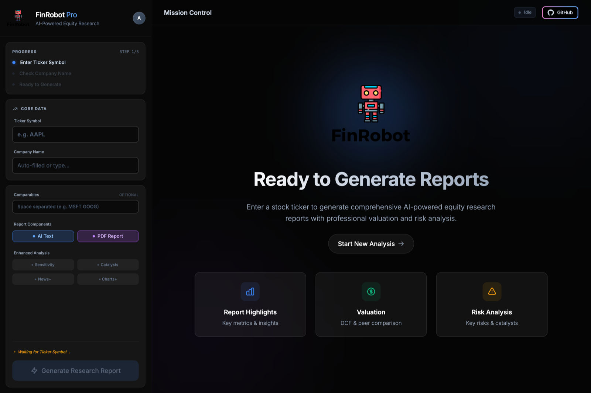
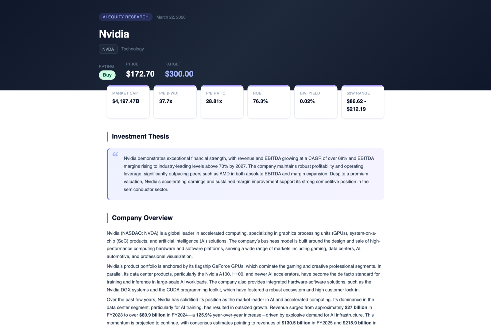
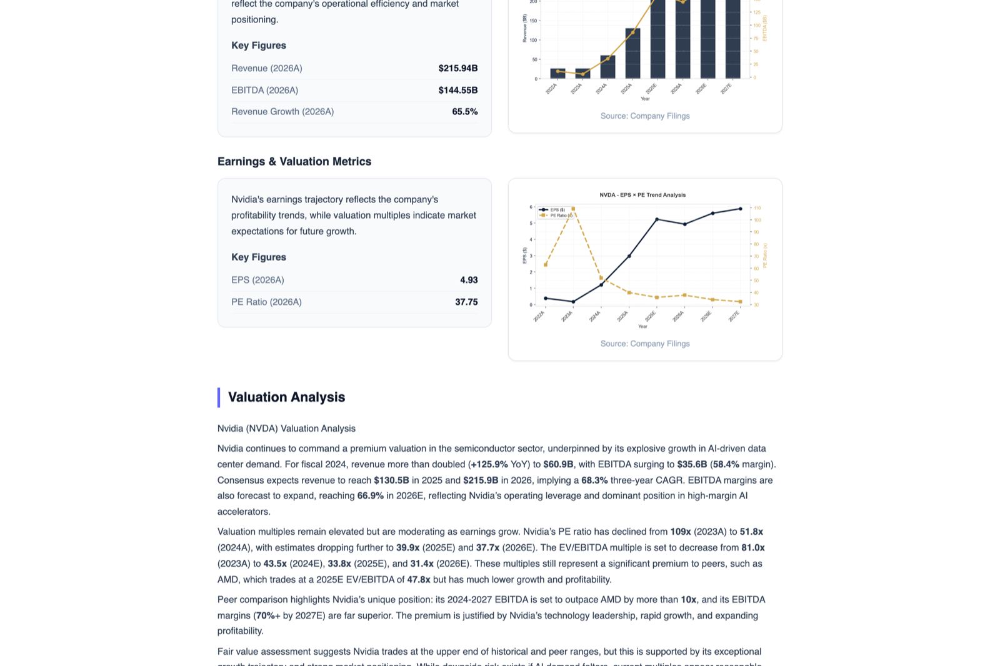

# FinRobot Equity — V1

> **A self-hosted web app.** AI-powered equity research report generator: fetches financial data, runs LLM-based analysis, and produces professional multi-page HTML/PDF reports — from a browser or a single command.

This is V1 in the [FinRobot version lineage](../README.md). It is a **web service you deploy**, not a desktop application and not a framework — you run `./deploy.sh start`, open a browser, and people on your network get a form that turns a ticker into a report. That narrow shape is the point: one job, done through a UI.

Where it sits relative to the others:

- **[`finrobot_desktop/`](../finrobot_desktop/) (V2)** is the production agent system — a deeper research pipeline, a deterministic compute engine, and full numeric provenance. Choose it when the analysis itself matters most.
- **This project (V1)** is the choice when *browser access* matters most: a shared internal tool, a demo, a hosted deployment behind your own auth.
- **[`finrobot_autogen/`](../finrobot_autogen/) (V0)** is educational — the AutoGen library behind the whitepaper.

### Example output

[NVDA](https://ai4finance-foundation.github.io/FinRobot/finrobot_equity/core/output/NVDA_Equity_Research_Report.html) ·
[MSFT](https://ai4finance-foundation.github.io/FinRobot/finrobot_equity/core/output/MSFT_Equity_Research_Report.html) ·
[TSLA](https://ai4finance-foundation.github.io/FinRobot/finrobot_equity/core/output/TSLA_Equity_Research_Report.html) ·
[META](https://ai4finance-foundation.github.io/FinRobot/finrobot_equity/core/output/META_Equity_Research_Report.html) ·
[COP](https://ai4finance-foundation.github.io/FinRobot/finrobot_equity/core/output/COP_Equity_Research_Report.html)

The same files are checked in under `core/output/`.

<div align="center">

</div>

<p align="center"><i>The interface you deploy — enter a ticker, pick the peers and the sections you want, and generate.</i></p>

<div align="center">

</div>

<p align="center"><i>And what comes out: a standalone HTML report with a rating, a price target, the key multiples, and the thesis behind them.</i></p>

---

## Quick start

### 1. Configure API keys

From the repository root:

```bash
cp finrobot_equity/core/config/config.ini.example finrobot_equity/core/config/config.ini
```

```ini
[API_KEYS]
fmp_api_key    = YOUR_FMP_API_KEY       # https://financialmodelingprep.com/developer
openai_api_key = YOUR_OPENAI_API_KEY    # https://platform.openai.com/account/api-keys
adanos_api_key = YOUR_ADANOS_API_KEY    # optional — enables Retail Sentiment Insights
```

`config.ini` is gitignored; `config.ini.example` is the file under version control.

With `adanos_api_key` set, the pipeline adds an optional **Retail Sentiment Insights** layer on top of the news workflow — structured snapshots of public retail activity across Reddit, X.com, and Polymarket.

### 2. Run the web app

From this directory:

```bash
chmod +x deploy.sh
./deploy.sh start
```

Then open `http://127.0.0.1:8001`.

If `deploy.sh` doesn't work in your environment, start it by hand:

```bash
python3 -m venv venv
source venv/bin/activate
pip install -r requirements.txt
python run_web_app.py           # --host / --port / --no-reload are available
```

### 3. Or run the two-step CLI pipeline

```bash
# Step 1 — fetch data, forecast, and generate the narrative sections
python finrobot_equity/core/src/generate_financial_analysis.py \
    --company-ticker NVDA \
    --company-name "NVIDIA Corporation" \
    --config-file finrobot_equity/core/config/config.ini \
    --peer-tickers AMD INTC \
    --generate-text-sections

# Step 2 — render the HTML report from step 1's outputs
python finrobot_equity/core/src/create_equity_report.py \
    --company-ticker NVDA \
    --company-name "NVIDIA Corporation" \
    --analysis-csv output/NVDA/analysis/financial_metrics_and_forecasts.csv \
    --ratios-csv   output/NVDA/analysis/ratios_raw_data.csv \
    --tagline-file             output/NVDA/analysis/tagline.txt \
    --company-overview-file    output/NVDA/analysis/company_overview.txt \
    --investment-overview-file output/NVDA/analysis/investment_overview.txt \
    --valuation-overview-file  output/NVDA/analysis/valuation_overview.txt \
    --risks-file               output/NVDA/analysis/risks.txt \
    --competitor-analysis-file output/NVDA/analysis/competitor_analysis.txt \
    --major-takeaways-file     output/NVDA/analysis/major_takeaways.txt \
    --peer-ev-ebitda-csv       output/NVDA/analysis/peer_ev_ebitda_comparison.csv \
    --enable-text-regeneration \
    --config-file finrobot_equity/core/config/config.ini
```

`generate_pdf_report.py` turns the HTML into a PDF as an optional third step. `core/src/Run.ipynb` walks the same pipeline in a notebook.

---

## How it works

```
┌─────────────────────────────────┐     ┌──────────────────────────────┐
│  generate_financial_analysis.py │     │  create_equity_report.py     │
│                                 │     │                              │
│  1. Fetch data from FMP API     │────>│  1. Load analysis outputs    │
│  2. Process financial metrics   │     │  2. Auto-fetch market data   │
│  3. Generate 3-year forecasts   │     │  3. Generate charts          │
│  4. Run peer comparison         │     │  4. Render HTML report       │
│  5. AI text generation          │     │  5. Validate & regenerate    │
│                                 │     │                              │
│  Output: CSV + JSON + TXT       │     │  Output: multi-page HTML     │
└─────────────────────────────────┘     └──────────────────────────────┘
```

<div align="center">

</div>

<p align="center"><i>Each section pairs figures computed from the FMP data — revenue/EBITDA trajectory, EPS against the P/E multiple — with the paragraph an agent wrote about them.</i></p>

Step 1 is deterministic up to the last stage: the statements, ratios, forecasts, and peer multiples are computed from FMP data before any model is called. Step 2 can optionally re-run the narrative agents (`--enable-text-regeneration`) when a section fails validation.

### The agents

Eight section writers in `core/src/modules/equity_agents/`, coordinated by `agent_manager.py`:

| Agent | Section it writes |
|:---|:---|
| `tagline_agent` | One-line thesis for the cover |
| `company_overview_agent` | Business description |
| `investment_overview_agent` | Investment thesis |
| `valuation_overview_agent` | Valuation discussion |
| `risks_agent` | Risk assessment |
| `competitor_analysis_agent` | Competitive landscape |
| `major_takeaways_agent` | Key takeaways |
| `news_summary_agent` | News summary |

Each agent receives the already-computed numbers as context, so the narrative describes the model's output rather than inventing figures.

### Layout

```
finrobot_equity/
├── core/                                    # Analysis engine
│   ├── config/config.ini.example            #   API key template
│   ├── src/
│   │   ├── generate_financial_analysis.py   #   Step 1 — data + analysis
│   │   ├── create_equity_report.py          #   Step 2 — HTML report
│   │   ├── generate_pdf_report.py           #   Step 3 — PDF (optional)
│   │   ├── Run.ipynb                        #   Notebook walkthrough
│   │   └── modules/
│   │       ├── common_utils.py              #     Config & API key management
│   │       ├── market_data_api.py           #     FMP client
│   │       ├── financial_data_processor.py  #     Metrics extraction & forecasting
│   │       ├── valuation_engine.py          #     Valuation modeling
│   │       ├── sensitivity_analyzer.py      #     Sensitivity analysis
│   │       ├── catalyst_analyzer.py         #     Catalyst identification
│   │       ├── news_integrator.py           #     News integration
│   │       ├── retail_sentiment_client.py   #     Optional retail sentiment
│   │       ├── text_generator_agents.py     #     LLM orchestration
│   │       ├── enhanced_text_generator.py   #     Narrative post-processing
│   │       ├── chart_generator.py           #     Chart rendering
│   │       ├── enhanced_chart_generator.py  #     Advanced chart configs
│   │       ├── html_renderer.py             #     HTML renderer
│   │       ├── html_template_professional.py#     HTML templates
│   │       ├── report_data_loader.py        #     Data loading
│   │       ├── report_structure.py          #     Report layout
│   │       ├── pdf_generator.py             #     PDF generation
│   │       ├── professional_pdf_report.py   #     PDF templates
│   │       └── equity_agents/               #     The eight section writers
│   ├── output/                              #   Generated + checked-in sample reports
│   └── tests/                               #   test_generate_report, test_modules,
│                                            #   test_retail_sentiment_client
└── web_app/                                 # FastAPI web interface
    ├── main.py                              #   App entry point & API routes
    ├── auth.py                              #   Auth (local + GitHub OAuth)
    ├── admin_routes.py                      #   Admin endpoints
    ├── database/                            #   SQLAlchemy + SQLite
    ├── middleware/request_logger.py         #   Request logging
    ├── templates/                           #   index, login, parallel_dashboard
    ├── static/                              #   CSS & images
    └── data/                                #   Runtime data (auto-created, gitignored)
```

---

## Reference

### Deployment commands

Run from this directory, or from the repo root as `./finrobot_equity/deploy.sh …` — the script resolves its own paths either way.

| Command | Description |
|:---|:---|
| `./deploy.sh start` | Start the web application (auto-installs dependencies) |
| `./deploy.sh stop` | Stop the application |
| `./deploy.sh restart` | Restart the application |
| `./deploy.sh status` | Check running status and recent logs |
| `./deploy.sh install` | Install/update dependencies only |

`deploy.gcloud.sh` covers Google Cloud Run deployment. The `Dockerfile` and `.dockerignore` stay at the repo root: the container imports the app as `finrobot_equity.web_app.main`, so the build context has to be the root with `finrobot_equity/` as a subdirectory under it.

### Environment variables

| Variable | Default | Description |
|:---|:---|:---|
| `WEB_HOST` | `127.0.0.1` | Server bind address (read by `deploy.sh`) |
| `WEB_PORT` | `8001` | Server port (read by `deploy.sh`) |
| `DATABASE_URL` | local SQLite | Database connection string |
| `GITHUB_CLIENT_ID` | — | GitHub OAuth client ID |
| `GITHUB_CLIENT_SECRET` | — | GitHub OAuth client secret |
| `FINROBOT_ADMIN_EMAIL` | `admin@finrobot.com` | Initial admin account |
| `FINROBOT_ADMIN_EMAILS` | — | Additional admin emails (comma-separated) |
| `FINROBOT_ADMIN_PASSWORD` | random | Initial admin password — printed on first start if unset |
| `ADANOS_API_KEY` | — | Retail sentiment key (alternative to `config.ini`) |
| `ADANOS_BASE_URL` | provider default | Override the retail sentiment endpoint |

### External services

| Service | Required | Purpose |
|:---|:---|:---|
| [Financial Modeling Prep](https://financialmodelingprep.com/developer) | Yes | Financial data, market metrics, peer comparison |
| [OpenAI](https://platform.openai.com/) | Yes | Narrative generation for report sections |
| Adanos Finance API | No | Retail sentiment across Reddit, X.com, Polymarket |

### Tests

```bash
pytest finrobot_equity/core/tests/
```

## License

Apache 2.0 — see [LICENSE](../LICENSE).
