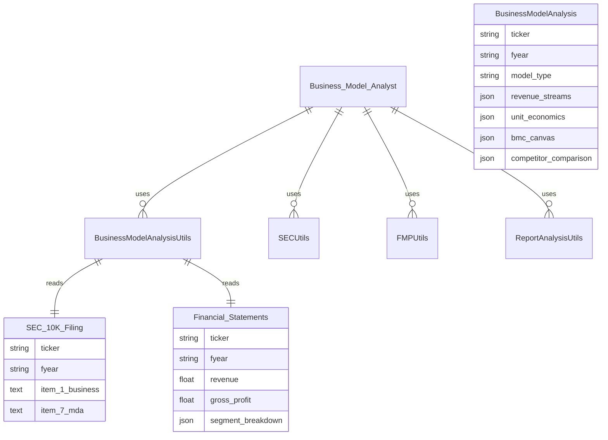

# feat: Business Model Analyst Agent

**Created:** 2025-12-26
**Type:** Enhancement
**Status:** ✅ COMPLETE

> **Implementation Verified:** 2025-12-26
> - All 6 tests passing
> - Agent registered in `finrobot/agents/agent_library.py:82-135`
> - Utilities implemented in `finrobot/functional/business_model_utils.py`
> - Tests at `tests/test_business_model_analyst.py`

---

## Overview

Add a new specialized agent to the FinRobot project that analyzes company operating models and revenue generation mechanisms. This agent will complement the existing `Expert_Investor` agent by providing deep-dive analysis into **how companies make money**, their unit economics, and competitive positioning from a business model perspective.

## Problem Statement / Motivation

The current FinRobot agent library focuses heavily on financial statement analysis and market forecasting. However, understanding **the business model behind the numbers** is critical for:

1. **Investment decisions** - Revenue quality matters as much as revenue quantity
2. **Competitive analysis** - Understanding moat and defensibility
3. **Growth trajectory prediction** - Different revenue models scale differently
4. **Risk assessment** - Concentration, customer dependency, margin sustainability

## Proposed Solution

Create a `Business_Model_Analyst` agent following the existing agent library pattern at `finrobot/agents/agent_library.py`.

### Agent Definition

```python
# finrobot/agents/agent_library.py

{
    "name": "Business_Model_Analyst",
    "profile": dedent(
        """
        Role: Business Model Analyst
        Department: Strategic Research
        Primary Responsibility: Analysis of Company Operating Models and Revenue Generation

        Expertise Areas:
        - Business Model Canvas analysis (9 building blocks)
        - Revenue stream identification and categorization
        - Unit economics calculation (LTV, CAC, NRR, Churn, Gross Margin)
        - Value chain analysis (Porter's framework)
        - Competitive operating model comparison
        - Revenue segment growth trajectory analysis

        Revenue Model Classification:
        - Subscription/SaaS: Recurring revenue, retention metrics
        - Licensing: IP monetization, royalty structures
        - Advertising: User engagement, CPM/CPC models
        - Transaction fees: Take rate, GMV analysis
        - Hardware: Product margins, attach rates
        - Services: Utilization, billing rates
        - Freemium: Conversion rates, ARPU
        - Marketplace: Two-sided network effects

        Data Sources:
        - SEC 10-K filings (Item 1: Business Description, Item 7: MD&A)
        - Earnings call transcripts
        - Company investor presentations
        - Financial statements (revenue breakdown)
        - Industry comparables

        Output Format:
        - Structured analysis with clear sections
        - Quantitative metrics where available
        - Qualitative insights on business model strength
        - Competitive comparison tables

        Reply TERMINATE when the analysis is complete.
        """
    ),
    "toolkits": [
        FMPUtils.get_company_profile,
        FMPUtils.get_income_statement,
        FMPUtils.get_sec_report,
        SECUtils.get_10k_section,
        BusinessModelAnalysisUtils,  # NEW - to be created
        ReportAnalysisUtils.analyze_company_description,
        ReportAnalysisUtils.analyze_segment_stmt,
        ReportAnalysisUtils.analyze_business_highlights,
        TextUtils.check_text_length,
    ],
}
```

## Technical Approach

### Architecture

The implementation follows existing FinRobot patterns:

```
finrobot/
├── agents/
│   └── agent_library.py          # Add Business_Model_Analyst definition
├── functional/
│   └── business_model_utils.py   # NEW: Business model analysis utilities
├── data_source/
│   └── sec_utils.py              # Existing: SEC 10-K section extraction
│   └── fmp_utils.py              # Existing: Financial data
└── toolkits.py                   # Register new toolkit class
```

### Implementation Phases

#### Phase 1: Core Toolkit Functions

Create `finrobot/functional/business_model_utils.py`:

```python
# finrobot/functional/business_model_utils.py

from typing import Annotated
from finrobot.data_source import SECUtils, FMPUtils

class BusinessModelAnalysisUtils:
    """Utilities for analyzing company business models and revenue generation."""

    @staticmethod
    def analyze_revenue_streams(
        ticker_symbol: Annotated[str, "Stock ticker symbol (e.g., 'AAPL')"],
        fyear: Annotated[str, "Fiscal year for analysis (e.g., '2024')"],
        save_path: Annotated[str, "Path to save the analysis output"]
    ) -> str:
        """
        Analyze company revenue streams from SEC filings and financial data.

        Extracts:
        - Revenue segment breakdown
        - Geographic distribution
        - Product vs service mix
        - Recurring vs non-recurring revenue
        """
        # 1. Get SEC 10-K Item 1 (Business Description)
        business_desc = SECUtils.get_10k_section(ticker_symbol, fyear, 1)

        # 2. Get revenue breakdown from FMP
        income_stmt = FMPUtils.get_income_statement(ticker_symbol, fyear)

        # 3. Get SEC 10-K Item 7 (MD&A) for segment analysis
        mda_section = SECUtils.get_10k_section(ticker_symbol, fyear, 7)

        # 4. Create analysis prompt
        instruction = f"""
        Analyze the revenue streams for {ticker_symbol} in fiscal year {fyear}.

        Extract and categorize:
        1. Primary revenue streams (by product/service line)
        2. Revenue model type (subscription, licensing, transaction, etc.)
        3. Geographic breakdown
        4. Customer concentration risks
        5. Recurring vs non-recurring revenue mix

        Use the following data sources:
        - Business Description: {business_desc[:5000]}
        - MD&A Section: {mda_section[:5000]}
        - Income Statement: {income_stmt}
        """

        # 5. Save and return
        with open(save_path, 'w') as f:
            f.write(instruction)

        return f"Revenue stream analysis saved to {save_path}"

    @staticmethod
    def analyze_unit_economics(
        ticker_symbol: Annotated[str, "Stock ticker symbol"],
        fyear: Annotated[str, "Fiscal year for analysis"],
        save_path: Annotated[str, "Path to save the analysis output"]
    ) -> str:
        """
        Analyze unit economics and key business drivers.

        Calculates (where data available):
        - Gross margin analysis
        - Customer metrics (if SaaS/subscription)
        - Operating leverage
        - Revenue per employee
        - Rule of 40 (for growth companies)
        """
        # Implementation follows same pattern as above
        pass

    @staticmethod
    def classify_business_model(
        ticker_symbol: Annotated[str, "Stock ticker symbol"],
        fyear: Annotated[str, "Fiscal year for analysis"],
        save_path: Annotated[str, "Path to save the analysis output"]
    ) -> str:
        """
        Classify the company's business model using Business Model Canvas framework.

        Analyzes 9 building blocks:
        1. Customer Segments
        2. Value Propositions
        3. Channels
        4. Customer Relationships
        5. Revenue Streams
        6. Key Resources
        7. Key Activities
        8. Key Partnerships
        9. Cost Structure
        """
        pass

    @staticmethod
    def compare_operating_models(
        ticker_symbol: Annotated[str, "Primary company ticker"],
        competitors: Annotated[str, "Comma-separated list of competitor tickers"],
        fyear: Annotated[str, "Fiscal year for comparison"],
        save_path: Annotated[str, "Path to save the comparison output"]
    ) -> str:
        """
        Compare operating models with competitors.

        Comparison dimensions:
        - Revenue model type
        - Gross margin profile
        - Operating margin
        - Revenue per employee
        - Growth rate
        - Capital intensity
        """
        pass

    @staticmethod
    def analyze_revenue_quality(
        ticker_symbol: Annotated[str, "Stock ticker symbol"],
        fyear: Annotated[str, "Fiscal year for analysis"],
        save_path: Annotated[str, "Path to save the analysis output"]
    ) -> str:
        """
        Assess revenue quality and sustainability.

        Evaluates:
        - Recurring revenue percentage
        - Customer concentration (top 10 customers %)
        - Contract length and backlog
        - Deferred revenue trends
        - Revenue recognition policies
        """
        pass
```

#### Phase 2: Agent Registration

Update `finrobot/agents/agent_library.py`:

```python
# Add import at top
from finrobot.functional.business_model_utils import BusinessModelAnalysisUtils

# Add to agent_library dictionary
library["Business_Model_Analyst"] = {
    "name": "Business_Model_Analyst",
    "profile": dedent("""..."""),  # Full profile from above
    "toolkits": [
        FMPUtils.get_company_profile,
        FMPUtils.get_income_statement,
        FMPUtils.get_sec_report,
        SECUtils.get_10k_section,
        BusinessModelAnalysisUtils,
        ReportAnalysisUtils.analyze_company_description,
        ReportAnalysisUtils.analyze_segment_stmt,
        ReportAnalysisUtils.analyze_business_highlights,
        TextUtils.check_text_length,
    ],
}
```

#### Phase 3: Multi-Agent Integration

Enable the Business Model Analyst to collaborate with Expert_Investor in a `MultiAssistantWithLeader` workflow:

```python
# Example usage in workflow
from finrobot.agents import MultiAssistantWithLeader

workflow = MultiAssistantWithLeader(
    agents_config=["Business_Model_Analyst", "Expert_Investor"],
    leader_config="Expert_Investor",  # Leader synthesizes insights
    config_list=config_list,
)

# The Business Model Analyst provides operating model context
# The Expert Investor integrates it into the financial analysis
```

## Acceptance Criteria

### Functional Requirements

- [ ] Create `BusinessModelAnalysisUtils` class with 5 core methods
- [ ] Add `Business_Model_Analyst` to agent library
- [ ] Agent can analyze revenue streams from SEC filings
- [ ] Agent can classify business models using BMC framework
- [ ] Agent can compare operating models across competitors
- [ ] Agent can assess unit economics metrics

### Non-Functional Requirements

- [ ] Follow existing code patterns (Annotated types, save-to-file pattern)
- [ ] Include docstrings for all public methods
- [ ] Handle missing data gracefully (not all companies have all metrics)
- [ ] Support all ticker symbols that have SEC 10-K filings

### Testing Requirements

- [ ] Test with diverse company types (SaaS, hardware, marketplace, advertising)
- [ ] Test edge cases (missing SEC filings, private subsidiaries)
- [ ] Verify multi-agent collaboration works correctly

## Success Metrics

1. **Completeness**: Agent extracts revenue breakdown for 90%+ of S&P 500 companies
2. **Accuracy**: Business model classification matches manual expert analysis
3. **Integration**: Works seamlessly with existing Expert_Investor workflow
4. **Performance**: Analysis completes within 60 seconds per company

## Dependencies & Prerequisites

- Existing `SECUtils.get_10k_section()` - already implemented
- Existing `FMPUtils.get_income_statement()` - already implemented
- Existing `ReportAnalysisUtils` - already implemented
- pyautogen framework patterns - documented

## Risk Analysis & Mitigation

| Risk | Impact | Mitigation |
|------|--------|------------|
| SEC filings don't have segment breakdown | Medium | Fall back to MD&A qualitative analysis |
| International companies have different filing formats | Low | Start with US-listed companies only |
| Unit economics data not available for all companies | Medium | Make metrics optional, report what's available |
| LLM hallucination on business model classification | High | Ground all analysis in source data citations |

## File Changes Summary

| File | Action | Description |
|------|--------|-------------|
| `finrobot/functional/business_model_utils.py` | CREATE | New toolkit class with 5 methods |
| `finrobot/agents/agent_library.py` | MODIFY | Add Business_Model_Analyst definition |
| `finrobot/__init__.py` | MODIFY | Export BusinessModelAnalysisUtils |
| `tests/test_business_model_analyst.py` | CREATE | Unit tests for new agent |

## References & Research

### Internal References

- Agent definition pattern: `finrobot/agents/agent_library.py:1-50`
- Toolkit registration: `finrobot/toolkits.py:1-100`
- Analyzer pattern: `finrobot/functional/analyzer.py:1-200`
- SEC data extraction: `finrobot/data_source/sec_utils.py`
- Workflow patterns: `finrobot/agents/workflow.py:32-59`

### External References

- pyautogen Documentation: https://microsoft.github.io/autogen/
- Business Model Canvas: Osterwalder & Pigneur framework
- Porter's Value Chain Analysis
- SEC EDGAR Filing Types: https://www.sec.gov/forms

### Revenue Model Taxonomy

| Model Type | Key Metrics | Example Companies |
|------------|-------------|-------------------|
| Subscription/SaaS | NRR, Churn, LTV/CAC | Salesforce, Adobe |
| Licensing | Royalty rate, IP portfolio | Microsoft, Qualcomm |
| Advertising | DAU, ARPU, CPM | Meta, Google |
| Transaction fees | Take rate, GMV | Visa, PayPal |
| Hardware | Unit margin, attach rate | Apple, Dell |
| Services | Utilization, billing rate | Accenture, Deloitte |
| Freemium | Conversion rate, ARPU | Spotify, Dropbox |
| Marketplace | GMV, take rate, NPS | Amazon, Airbnb |

---

## ERD: Data Flow



---

**Plan created by:** Claude Code with /compound-engineering:plan
**Research sources:** repo-research-analyst, best-practices-researcher, framework-docs-researcher, spec-flow-analyzer
